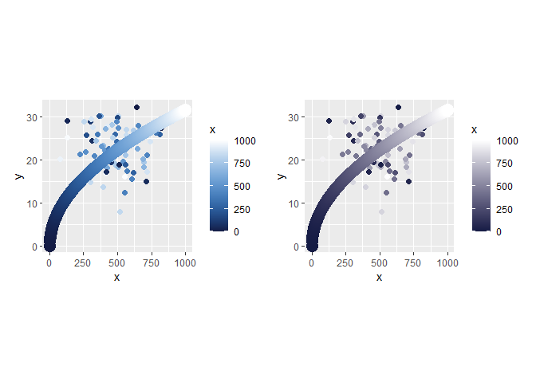
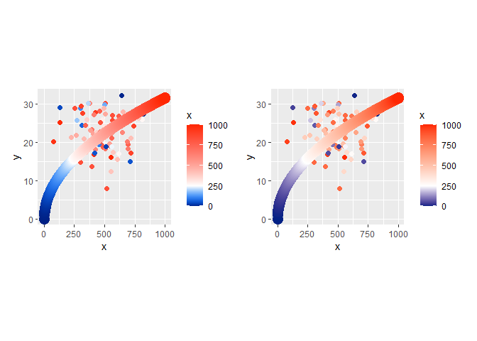

<!-- README.md is generated from README.Rmd. Please edit that file -->

# sosMixboxRcpp

This is a proof of concept package providing functions for color
blending using [mixbox](https://github.com/scrtwpns/mixbox). I primarily
made this just to learn how to work with Rcpp a bit more. This package
provides a wrapper to the mixbox C++ code to blend two colors together
via Rcpp. This package is not licensed for commercial use, see mixbox’s
CC BY-NC 4.0 license
[here](https://github.com/scrtwpns/mixbox?tab=License-1-ov-file#readme).

## Installation

You can install the development version of sosMixboxRcpp like so:

``` r
remotes::install_github("tsostarics/sosMixboxRcpp")
```

## Example

``` r
library(sosMixboxRcpp) # For mixing
library(colorspace)    # For displaying colors
library(ggplot2)       # For plots
library(patchwork)     #
```

The package provides a list of colors `PIGMENTS` as defined by the
authors of mixbox. We can blend two colors together like in the below
example, where mixing blue and yellow gives green as expected.

``` r
blend_colors(PIGMENTS$PhthaloBlue, PIGMENTS$CadmiumYellow) |> 
  colorspace::swatchplot()
```


We can also create gradients using pigment blending like below. On the
left is the gradient with pigment blending, on the right is the typical
linear interpolation between colors.

``` r
# pigmentRamp returns a function
blend_ramp  <- pigmentRamp(c(PIGMENTS$PhthaloBlue, PIGMENTS$CadmiumYellow))

# Get 10 interpolated colors
normal_ramp <- colorRampPalette(c(PIGMENTS$PhthaloBlue, 
                                  PIGMENTS$CadmiumYellow))(11)

swatchplot(c(blend_ramp(seq(0,1,.1)), normal_ramp), 
           cvd = c('desaturate', 'deutan'))
```


We can also make a visualization like so:

``` r
data <- data.frame(x = 0:1000, y = sqrt(0:1000))
data2 <- data.frame(x = rnorm(100, 500, 150),
                    y = sqrt(rnorm(100, 500, 200)),
                    color = rbeta(100,1,1)*1000)


p1 <- 
  ggplot(data, aes(x = x, y = y, color = x)) +
  geom_point(data = data2, aes(color = color), size=2) +
  geom_point(size = 5) +
  scale_color_mixbox(low = PIGMENTS$PhthaloBlue,
                     high = PIGMENTS$HansaYellow) +
  coord_fixed(ratio = sqrt(1000))

p2 <- p1 + scale_color_gradient(low = PIGMENTS$PhthaloBlue,
                                high = PIGMENTS$HansaYellow)

p1 + p2
```


Note that you don’t *have* to use the pigments, you can use hex strings
or colors defined by R.

``` r
(p1 + scale_color_mixbox(low  = "#141b44",
                         high = 'white')) +
  ((p1 + scale_color_gradient(low  = "#141b44",
                              high = 'white')))
```



``` r
(p1 + scale_color_mixboxn(colors = c(PIGMENTS$CobaltBlue,
                                     'white',
                                     PIGMENTS$CadmiumRed),
                          values = c(0, .25, 1))) +
  ((p1 + scale_color_gradientn(colors = c(PIGMENTS$CobaltBlue,
                                          'white',
                                          PIGMENTS$CadmiumRed),
                               values = c(0, .25, 1))))
```



``` r
rainbow_colors <- c('red', 'orange','yellow', 'green', 'blue', 'purple3')
(p1 + scale_color_mixboxn(colors = rainbow_colors)) +
  ((p1 + scale_color_gradientn(colors = rainbow_colors)))
```


And a categorical example:

``` r
bar_colors <- blend_palette(6, c(PIGMENTS$CobaltViolet, 'white', 'seagreen'))

ggplot(mtcars, aes(x = carb, 
                   y = mpg, 
                   color = factor(carb),
                   fill = factor(carb))) +
  stat_summary(geom = 'bar',
               fun = mean) +
  scale_fill_manual(values = bar_colors)+
  scale_color_manual(values = desaturate(darken(bar_colors, .8), .4)) +
  coord_fixed(ratio = 8 / 25)
```


### Warnings for data visualizations

One property of pigment blending is that colors tend to become more
saturated and can have a slight hue shift when blended with white (c.f.
interpolation which leads to desaturation). Note in the deuteranope view
that the middle of the gradient is slightly purple.

``` r
blend_ramp  <- pigmentRamp(c('red4', 'white'))

# Get 10 interpolated colors
normal_ramp <- colorRampPalette(c('red4', 'white'))(11)

swatchplot(c(blend_ramp(seq(0,1,.1)), normal_ramp), 
           cvd = c('desaturate', 'deutan'))
```


Similarly, in a diverging palette, we can see the left palette isn’t
varying entirely shades of brown when applying a deuteranope filter:

``` r
blend_ramp  <- pigmentRamp(c('red4', 'white', 'navy'))

# Get 10 interpolated colors
normal_ramp <- colorRampPalette(c('red4', 'white', 'navy'))(11)

swatchplot(c(blend_ramp(seq(0,1,.1)), normal_ramp), 
           cvd = c('desaturate', 'deutan'))
```


Some colors play a bit better together:

``` r
blend_ramp  <- pigmentRamp(c(PIGMENTS$CobaltViolet, 'white', 'seagreen'))

# Get 10 interpolated colors
normal_ramp <- colorRampPalette(c(PIGMENTS$CobaltViolet, 'white', 'seagreen'))(11)

swatchplot(c(blend_ramp(seq(0,1,.1)), normal_ramp), 
           cvd = c('desaturate', 'deutan'))
```


So, this shouldn’t be regarded as a kindof drop-in replacement for
making colors look more vibrant; you should double check the
accessibility of any palettes you use.
